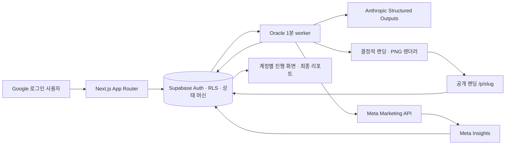

<p align="center">
  
</p>

<p align="center">
  아이디어 검증 전에 반복하던 광고 기획·제작·집행·취합을 없애는 자동 시장검증 서비스
</p>

<p align="center">
  <a href="https://marketvaley.vercel.app">서비스 열기</a> ·
  <a href="https://github.com/unithon26/marketvalley/actions/workflows/ci.yml"></a>
</p>

# marketvalley

marketvalley는 첫 시장 반응을 확인하려는 예비창업가와 1인 사업자를 위한 UNITHON 2026 프로젝트다. 사용자는 문제 배경과 솔루션을 한 번 입력한다. 이후 시스템이 같은 검증 가설에서 랜딩페이지, Instagram 카드뉴스, 광고 문구와 Meta 광고를 만들고 실제 반응을 수집해 하나의 리포트로 돌려준다.

핵심은 더 많은 콘텐츠를 빠르게 만드는 것이 아니다. 고객을 만나기 전에 사람이 반복하던 채널별 재작성, 조판, 파일 정리, 광고 등록, 상태 확인과 데이터 취합을 없애는 것이다. 시장성 판단과 실제 고객 대화는 사람에게 남긴다.

## 사라지는 일

| 기존 흐름 | marketvalley 이후 |
| --- | --- |
| 고객·문제·가치 제안을 채널마다 다시 작성 | 배경과 솔루션을 한 번 입력 |
| 웹 빌더에서 랜딩페이지 조립·배포 | 같은 spec에서 공개 URL 자동 생성 |
| 카드 5장을 직접 조판·내보내기 | 1080×1350 PNG 5장과 ZIP 자동 생성 |
| 캡션·CTA·링크를 다시 맞추기 | 랜딩·카드·광고가 같은 메시지 사용 |
| Ads Manager에 소재와 설정을 옮기기 | 승인된 계정·예산 경계에서 자동 등록·활성화 |
| 다음 날 상태를 확인하고 지표를 다시 취합 | 서버 worker가 계속 수집하고 계정별 상태 복원 |
| 여러 표를 합쳐 결과 문서 작성 | 실제 Insights·방문·예약 기반 리포트 자동 완성 |

사용자에게 남는 단계는 `아이디어 입력 → 실제 반응을 기다림 → 계속 검증·수정·보류 판단`이다.

## 실제 제품 흐름

1. Google로 로그인하면 해당 계정의 진행 중·완료 광고만 불러온다.
2. 2단계 입력을 제출하면 브라우저보다 먼저 Supabase에 `SUBMITTED` 상태를 저장한다.
3. Oracle worker가 Claude 문구 생성, 공개 랜딩과 카드뉴스 제작, Meta 광고 등록·활성화를 순서대로 처리한다.
4. 사용자가 탭을 닫아도 상태 머신과 lease가 작업을 재개한다.
5. 광고 집행 중에는 Meta Insights, 고유 랜딩 방문과 동의 기반 예약을 수집한다.
6. 수집 종료 뒤 광고를 중지하고 최종 snapshot으로 리포트를 완성한다.
7. 사용자는 관찰된 값과 사전 기준을 보고 다음 행동을 직접 결정한다.

제품 화면에는 seed 프로젝트, 예시 자동 입력, 수동 Ads Manager 제어 버튼을 두지 않는다. 테스트 fixture와 발표용 수집 완료 예시는 운영 데이터와 분리된 명시적 경로에서만 사용한다.

## 아키텍처



- 단일 계약: Zod `CampaignSpec` v2가 검증 가설, 랜딩, 카드뉴스와 광고 문구를 묶는다.
- 영속 실행: Postgres `SKIP LOCKED` lease 상태 머신이 장기 작업과 재시도를 소유한다.
- 결정적 산출물: 화면 미리보기, 다운로드 ZIP과 실제 Meta 업로드가 같은 서버 PNG를 사용한다.
- 계정 격리: Google OAuth, HttpOnly 세션, Supabase RLS가 광고와 예약자명단 소유권을 검사한다.
- 실제 계측: 저장된 Meta Insights, 고유 방문과 예약만 표시하고 임의 지표를 만들지 않는다.
- 배포: Vercel 사용자 앱과 Oracle rootless Compose가 같은 검증된 source SHA를 사용한다.

정상 상태 전이는 다음과 같다.

```text
SUBMITTED → GENERATING → PREPARING → AWAITING_ACTIVATION
          → COLLECTING → FINALIZING → COMPLETED
```

일시 오류는 입력과 원래 단계를 보존한 `RETRY_WAIT`, 안전하게 자동 복구할 수 없는 오류는 `FAILED`로 남는다.
첫 화면에서는 소유 프로젝트를 확인 후 삭제할 수 있다. 처리 중이거나 실제 광고가 집행 중인 프로젝트는 외부 광고만 남는 일을 막기 위해 삭제를 차단한다.

## 기술 스택

- Next.js 16 App Router, React 19, TypeScript 6
- Supabase Auth, Postgres, RLS, RPC
- Anthropic Messages API Structured Outputs
- Meta Marketing API와 Insights
- React/CSS 결정적 renderer, `ImageResponse`, JSZip
- Vitest, Playwright, GitHub Actions
- Vercel, Oracle Cloud NLB, rootless Docker Compose, Caddy

## 로컬 실행과 검증

필요한 환경은 Node.js 22 이상과 pnpm 10 이상이다.

```bash
git clone https://github.com/unithon26/marketvalley.git
cd marketvalley
corepack enable
pnpm install --frozen-lockfile
pnpm check
pnpm build
pnpm test:e2e
```

`pnpm test:e2e`는 외부 계정과 과금 없이 별도 production build를 띄워 빈 계정, 2단계 입력, 상태 복원, 카드 PNG·ZIP, 공개 예약과 최종 리포트를 검증한다. 실제 서비스 실행에 필요한 변수와 안전한 기본값은 [.env.example](.env.example)에 설명되어 있다. 운영 키는 서버 환경에만 두며 Git에 저장하지 않는다.

주요 명령:

| 명령 | 확인 범위 |
| --- | --- |
| `pnpm lint` | ESLint와 Next.js 규칙 |
| `pnpm typecheck` | Next.js route type 생성과 TypeScript |
| `pnpm test` | 계약·인증·RLS·AI·Meta·lifecycle 단위 테스트 |
| `pnpm test:auth-bundle` | 서버 비밀의 client bundle 비노출 |
| `pnpm build` | production Next.js build |
| `pnpm test:e2e` | production Chromium 종단 흐름 |

CI는 위 검사에 더해 배포 shell, Terraform, production container build와 smoke test를 실행한다.

## 검증과 진실성 경계

- 실제 광고 집행값과 예약 기록만 리포트에 표시한다.
- 이름·이메일은 명시적 동의 뒤 예약 목적으로만 받고, 소유자 목록에서도 이메일을 마스킹한다.
- 같은 광고의 같은 이메일은 한 번만 접수한다.
- 각 광고는 서버가 승인한 고정 lifetime 예산과 종료 시각 안에서만 집행한다.
- 자동 활성화는 고정 운영자, 광고계정과 lifetime 예산이 모두 일치할 때만 열린다.
- 자동 예산 증액, 종료 광고 재시작, 결제수단 등록은 하지 않는다.
- 예약이나 클릭을 시장성·매출·성공 가능성으로 자동 판정하지 않는다.
- 상태 이메일 발송 기능은 포함하지 않는다.
- 외부 API 실패를 fixture 성공으로 바꾸지 않는다. 제품은 재시도 또는 확인 필요 상태를 표시한다.

## 저장소 안내

- [제품 브리프](docs/brief.md): 사용자, 사라질 일과 성공 기준
- [MVP 스펙](docs/spec.md): 기능·데이터·API 계약
- [아키텍처](docs/architecture.md): 상태 머신과 외부 시스템 경계
- [사용자 흐름](docs/user-flow-and-wireframes.md): Before/After와 화면 요구사항
- [검증 기록](docs/validation.md): 실행한 자동·운영 검증
- [발표 실행서](docs/demo-runbook.md): 3분 데모 순서와 실패 대응
- [배포 가이드](docs/deployment.md): Vercel·Oracle release와 rollback
- [결정 기록](docs/decisions/): 주요 선택, 기각 대안과 이유
- [트러블슈팅](TROUBLESHOOTING.md): 실제 장애의 증거·원인·회귀 방지
- [작업 기록](WORKLOG.md): 날짜별 구현·검증·전달 내역
