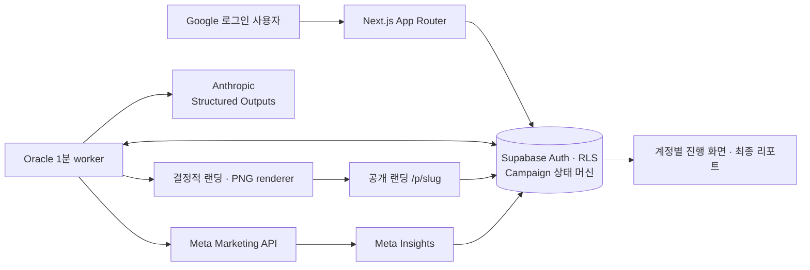

<p align="center">
  
</p>

<p align="center">
  아이디어 한 번으로 랜딩·카드뉴스·Meta 광고·실제 반응 리포트까지 이어지는 자동 시장검증 서비스
</p>

<p align="center">
  <a href="https://marketvaley.vercel.app"><strong>서비스</strong></a> ·
  <a href="https://marketvaley.vercel.app/presentation/report"><strong>발표용 리포트</strong></a> ·
  <a href="https://marketvaley.vercel.app/p/campaign-fa5197f4"><strong>공개 랜딩</strong></a> ·
  <a href="docs/demo-runbook.md"><strong>데모 실행서</strong></a>
</p>

<p align="center">
  <a href="https://github.com/unithon26/marketvalley/actions/workflows/ci.yml"></a>
</p>

# marketvalley

> UNITHON 2026 매니패스트 특별상 공식 수상

marketvalley는 첫 시장 반응을 확인하려는 예비창업가와 1인 사업자를 위한 서비스다. 문제 배경과
솔루션을 한 번 입력하면 같은 검증 가설에서 공개 랜딩, Instagram 카드뉴스 5장, 광고 문구와 Meta
광고를 만들고 실제 방문·예약·Insights를 하나의 리포트로 돌려준다.

핵심은 콘텐츠를 더 빨리 만드는 것이 아니다. 고객을 만나기 전에 반복하던 채널별 재작성, 조판,
파일 정리, 광고 등록, 상태 확인과 데이터 취합을 없애고 시장성 판단과 고객 대화는 사람에게 남긴다.

## 한눈에 보기

| 구분 | 내용 |
| --- | --- |
| 사용자 | 첫 시장 반응을 확인하려는 예비창업가·1인 사업자 |
| 사라지는 일 | 채널별 기획 재작성, 랜딩·카드 조판, 파일 정리, 광고 등록, 반응 취합 |
| 남는 사람의 역할 | 문제 선택, 공개 문구의 사실성 책임, 고객 대화, 계속·수정·보류 판단 |
| 핵심 산출물 | 공개 랜딩, 1080×1350 카드 5장과 ZIP, Meta 광고, 실제 반응 리포트 |
| 제품 경계 | Google 계정별 소유권, 고정 광고계정·예산·종료 시각, 측정값 기반 리포트 |
| 전달 | Vercel 사용자 앱과 Oracle lifecycle worker, Supabase, Meta Marketing API |

## 무엇이 달라지는가

| 기존 흐름 | marketvalley 이후 |
| --- | --- |
| 고객·문제·가치 제안을 채널마다 다시 작성 | 문제 배경과 솔루션을 한 번 입력 |
| 웹 빌더에서 랜딩을 조립하고 별도로 배포 | 한 번 입력한 검증 기획으로 공개 URL 생성 |
| 카드 5장을 직접 조판하고 파일로 정리 | 1080×1350 PNG 5장과 ZIP 생성 |
| 캡션·CTA·링크의 메시지를 다시 맞춤 | 랜딩·카드·광고가 하나의 검증 가설 사용 |
| 소재와 설정을 Ads Manager에 옮김 | 승인된 계정·예산 경계에서 자동 등록·활성화 |
| 상태를 확인하고 여러 표의 반응을 취합 | 실제 Insights·방문·예약을 리포트로 집계 |

사용자에게 남는 흐름은 `아이디어 입력 → 실제 반응 관찰 → 계속 검증할지 판단`이다.

## 제품 결과 예시

아래 카드는 발표용 고정 fixture를 실제 제품의 서버 renderer로 만든 결과다. 리포트의 예시 집계값은
운영 성과가 아니며, 실제 캠페인 화면에는 저장된 Meta Insights·방문·동의 기반 예약만 표시한다.

<p align="center">
  
  
  
  
  
</p>

[발표용 리포트와 같은 캠페인의 공개 랜딩 보기](PRESENTATION.md)

## 실제 제품 흐름

1. Google로 로그인하면 해당 계정이 소유한 진행 중·완료 광고만 불러온다.
2. 2단계 입력을 제출하면 브라우저보다 먼저 Supabase에 `SUBMITTED` 상태를 저장한다.
3. Oracle worker가 Claude 문구 생성, 공개 랜딩과 카드뉴스 제작, Meta 광고 등록·활성화를 처리한다.
4. 사용자가 탭을 닫아도 Postgres lease 상태 머신이 중단된 단계부터 작업을 이어간다.
5. 집행 중에는 Meta Insights, 고유 랜딩 방문과 동의 기반 예약을 저장한다.
6. 종료 뒤 광고 중지와 최종 snapshot을 확인하고 리포트를 완성한다.
7. 사용자는 관찰값과 사전에 정한 기준으로 계속·수정·보류를 직접 결정한다.

제품 화면에는 seed 프로젝트, 예시 자동 입력과 수동 Ads Manager 제어 버튼을 두지 않는다. 테스트
fixture와 발표용 완료 예시는 운영 데이터와 분리된 명시적 경로에서만 사용한다.

## 아키텍처



```text
SUBMITTED → GENERATING → PREPARING → AWAITING_ACTIVATION
          → COLLECTING → FINALIZING → COMPLETED
```

일시 오류는 입력과 원래 단계를 보존한 `RETRY_WAIT`, 안전하게 자동 복구할 수 없는 오류는 `FAILED`로
남긴다. 처리 중이거나 실제 광고가 집행 중인 프로젝트는 외부 광고만 남는 일을 막기 위해 삭제를
차단한다.

## 핵심 구현과 성과

| 영역 | 구현 | 확인할 수 있는 근거 |
| --- | --- | --- |
| 단일 콘텐츠 계약 | Zod `CampaignSpec` v2가 검증 가설, 랜딩, 카드 5장과 광고 문구를 묶고 서버가 최종 재검증 | [제품 스펙](docs/spec.md) · [ADR-0011](docs/decisions/0011-separate-fixed-figma-copy-and-ai-slots.md) |
| 영속 lifecycle | DB 선접수와 `SKIP LOCKED` lease로 Claude→renderer→Meta→Insights 작업을 브라우저와 분리 | [아키텍처](docs/architecture.md) · [PR #17](https://github.com/unithon26/marketvalley/pull/17) |
| 결정적 산출물 | 화면 미리보기, ZIP 다운로드와 Meta 업로드가 같은 서버 PNG renderer 사용 | [렌더링 결정](docs/decisions/0002-single-spec-deterministic-renderers.md) |
| 계정·데이터 격리 | Google OAuth, HttpOnly 세션, Supabase RLS와 원자 RPC로 광고·예약자명단 소유권 검사 | [인증 설계](docs/authentication.md) |
| 실제 광고·계측 | 승인된 광고계정과 lifetime 예산을 검사한 뒤 Meta 광고를 집행하고 Insights·방문·예약만 저장 | [검증 기록](docs/validation.md) · [PR #15](https://github.com/unithon26/marketvalley/pull/15) |
| 검증된 전달 | Vercel 앱과 Oracle worker를 독립 배포하고 각 release의 source SHA와 health를 확인 | [배포 설계](docs/deployment.md) · [ADR-0019](docs/decisions/0019-self-host-on-oracle-with-verified-ssh-releases.md) |

## 팀과 역할

공개 구현 이력과 프로젝트 문서에서 확인되는 책임 범위만 적었다. 이름이 공개 Git 이력에서
확인되지 않는 비개발 기여는 역할로 구분했다.

| 팀원 | 역할 | 맡은 범위와 핵심 성과 |
| --- | --- | --- |
| [홍성주](https://github.com/ghdtjdwn) | Backend · AI · Platform | 검증 가설·랜딩·카드뉴스·광고 문구를 하나의 데이터 구조로 설계하고, Anthropic 생성부터 Supabase 권한·API, Meta 광고·Insights, 장기 실행 상태 관리, Vercel·Oracle 배포·CI까지 통합해 아이디어 입력이 실제 광고와 결과 리포트로 이어지게 구현 · [PR #15](https://github.com/unithon26/marketvalley/pull/15) · [PR #17](https://github.com/unithon26/marketvalley/pull/17) |
| [박지성](https://github.com/jisung1017) | Product Frontend · UX | Figma 기반 홈·입력·진행·리포트 UI, 결정적 랜딩·카드 renderer, PNG·ZIP export, Google 로그인 진입과 production E2E를 구현 · [PR #1](https://github.com/unithon26/marketvalley/pull/1) · [PR #3](https://github.com/unithon26/marketvalley/pull/3) |
| Product Design | Visual System · Templates | 디자인 토큰, 랜딩 도입부 7종, 카드뉴스 표지 3종과 상태·발표 화면의 Figma 기준 제공 |

[역할과 파일 소유권](CONTRIBUTING.md#역할과-파일-소유권)에서 협업 경계를 확인할 수 있다.

## 기술 스택

| 영역 | 기술 |
| --- | --- |
| Product | Next.js 16 App Router, React 19, TypeScript, Zod |
| Data · Auth | Supabase Auth, PostgreSQL, RLS, RPC |
| AI · Ads | Anthropic Messages API Structured Outputs, Meta Marketing API · Insights |
| Rendering | React/CSS renderer, `ImageResponse`, JSZip |
| Delivery | Vercel, Oracle Cloud NLB, rootless Docker Compose, Caddy |
| Quality | Vitest, Playwright, GitHub Actions, Terraform, container smoke test |

## 검증과 진실성 경계

- 실제 광고 집행값과 예약 기록만 리포트에 표시한다.
- 이름·이메일은 명시적 동의 뒤 예약 목적으로만 받고 소유자 목록에서도 이메일을 마스킹한다.
- 같은 광고의 같은 이메일은 한 번만 접수한다.
- 서버가 승인한 광고계정, 고정 lifetime 예산과 종료 시각이 일치할 때만 광고를 활성화한다.
- 자동 예산 증액, 종료 광고 재시작과 결제수단 등록은 하지 않는다.
- 예약이나 클릭을 시장성·매출·성공 가능성으로 자동 판정하지 않는다.
- 외부 API 실패를 fixture 성공으로 바꾸지 않고 재시도 또는 확인 필요 상태로 남긴다.
- CI에서 lint, typecheck, 단위 테스트, production build, Chromium E2E, client bundle 비밀정보
  비노출, 배포 shell, Terraform과 container smoke를 검증한다.

[자동·운영·브라우저·배포 검증 기록 전체 보기](docs/validation.md)

## 로컬 실행

Node.js 22 이상과 pnpm 10 이상이 필요하다.

설치와 환경 준비:

```bash
git clone https://github.com/unithon26/marketvalley.git
cd marketvalley
corepack enable
pnpm install --frozen-lockfile
cp .env.example .env.local
```

빠른 회귀 검사와 전체 제품 흐름 검증:

```bash
pnpm check
pnpm build
pnpm exec playwright install chromium
pnpm test:e2e
```

`pnpm test:e2e`는 외부 계정과 과금 없이 별도 production build에서 빈 계정, 2단계 입력, 상태 복원,
카드 PNG·ZIP, 공개 예약과 최종 리포트를 검증한다. live adapter에 필요한 변수와 안전한 기본값은
[`.env.example`](.env.example)에 설명되어 있으며 운영 키는 서버 환경에만 둔다.

## 저장소 구조

```text
app/                 Next.js 화면과 Route Handler
components/          제품 UI와 결정적 랜딩·카드 renderer
lib/contracts/       CampaignSpec과 경계 타입
lib/ai/              Anthropic 생성 계약과 prompt
lib/supabase/        Supabase repository와 소유권 경계
lib/meta/            Meta 광고·Insights server-only provider
lib/lifecycle/       lease 상태 머신과 worker
supabase/migrations/ schema, RLS와 원자 RPC
tests/unit/          계약·AI·DB·Meta·lifecycle 회귀 테스트
tests/e2e/           production Chromium 종단 검증
infra/               Oracle NLB·Compose 전달 인프라
```

## 문서 지도

| 목적 | 문서 |
| --- | --- |
| 제품과 범위 | [제품 브리프](docs/brief.md) · [MVP 스펙](docs/spec.md) |
| 시스템과 데이터 경계 | [아키텍처](docs/architecture.md) · [인증](docs/authentication.md) |
| 검증과 운영 | [검증 기록](docs/validation.md) · [배포 가이드](docs/deployment.md) |
| 발표 | [3분 발표 구성](docs/pitch-outline.md) · [데모 실행서](docs/demo-runbook.md) · [발표 화면](PRESENTATION.md) |
| 의사결정과 작업 이력 | [ADR](docs/decisions/) · [작업 기록](WORKLOG.md) · [전체 문서](docs/README.md) |
