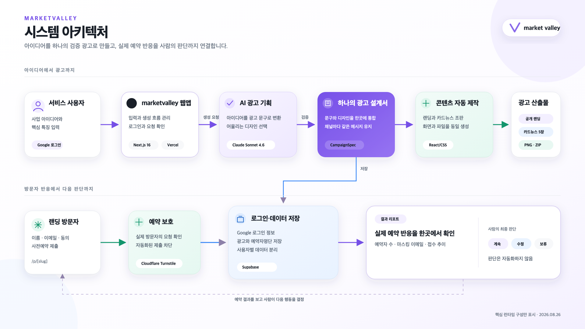

# 아키텍처



핵심 설계 의도: 사용자는 아이디어만 입력하고, AI와 하나의 광고 설계서가 랜딩·카드뉴스·게시 문구를 동시에 만들며, 실제 예약 반응을 바탕으로 한 최종 판단만 사람이 맡는다.

상태: Vercel 공식 서비스와 Oracle 독립 검증 서비스에 같은 검증 소스를 배포했으며, Anthropic·Supabase·Turnstile 운영 의존성까지 health 확인 완료
기준일: 2026-08-26

현재 저장소는 Anthropic 문구 생성기와 검증된 reference fixture가 같은 `CampaignGenerator` 계약을 사용한다. `CAMPAIGN_REPOSITORY_MODE=fixture`에서는 서버 프로세스 메모리로 발표 경로를 실행하고, `supabase`에서는 요청별 사용자 세션 client와 server-only client의 역할을 분리해 실제 DB를 사용한다. 제품 기본 생성은 `anthropic`, 자동 테스트와 비상 발표 fallback은 명시적인 `fixture`다.

Google 로그인은 Supabase Auth PKCE를 사용하는 서버 계약과 local 실제 계정 종단 검증까지 완료했다. `/auth/google → /auth/callback → /api/auth/session → /auth/logout`은 UI와 분리되어 있으며 토큰은 HttpOnly 쿠키에만 둔다. Supabase repository 모드의 소유자 route는 `requireVerifiedIdentity()`를 통과한 cookie session client로 쿼리하고, RLS가 `auth.uid() = owner_id`를 다시 검사한다. fixture route는 발표 안정성을 위해 로그인 없이 유지한다.

## 목표

발표용 mock과 Anthropic·Supabase 연동이 화면 코드를 바꾸지 않고 같은 `CampaignSpec`, `CampaignGenerator`, `CampaignRepository` 경계를 사용하게 한다. 외부 서비스 장애가 발표를 막지 않으며 fixture도 실제 Route Handler와 제품 화면을 그대로 지난다.

## 구성

```text
2단계 사용자 입력
   ↓ POST /api/generate
CampaignGenerator ── mock: 키워드 기반 시각 template 선택 + 중립 문장 골격 + 입력값 결정적 주입
   │                live: 슬롯별 지시를 조합한 단일 Claude Structured Outputs
   ↓
CampaignSpec (Zod 검증, 단일 진실 공급원)
   ↓ POST /api/campaigns
CampaignRepository ── mock: Node.js 프로세스 메모리
                     live: Supabase server repository
   ├─ publish / getById / getBySlug
   ├─ recordReservation / getReservationSummary
   ├─ saveNextAction / delete
   └─ LandingRenderer / CarouselRenderer / Meta 게시 준비 ZIP
```

브라우저에는 자신이 만든 캠페인의 draft 소유 토큰만 `localStorage`에 둔다. 공개 랜딩의 이름·이메일·동의와 UTM은 예약 제출 요청으로 서버에 보내고, 예약자명단과 사람의 다음 행동은 서버 저장소가 소유한다.

## 상태 원칙

- `CampaignSpec` 외에 화면별 카피 복제본을 만들지 않는다.
- `/campaigns/[id]`는 id로, `/p/[slug]`는 slug로 저장소를 조회한다.
- 새 게시에는 고유 id와 slug를 발급해 이미 열린 다른 캠페인 화면과 상태가 섞이지 않게 한다.
- 상품명, 핵심 특징 3개, 문제·솔루션, 가치 제안, CTA와 공개 경로는 게시된 campaign snapshot에서 파생한다.
- 공개 랜딩의 title·description과 랜딩·캐러셀 색상은 같은 snapshot의 SEO·brand 필드에서 파생한다.
- 카드뉴스 표지와 랜딩 도입부는 같은 snapshot의 `templates` 필드에서 선택하며, tone이나 화면별 조건으로 암묵적으로 추론하지 않는다.
- mock 데이터는 화면에서 `데모 데이터`로 식별한다.
- P0 예약은 명시적 동의 뒤 이름과 이메일만 저장한다. IP와 원문 user-agent는 저장하지 않고, 목록 화면의 이메일은 마스킹한다.
- 저장·응답·판단·초기화 실패를 성공으로 표시하지 않으며 사용자가 재시도할 수 있다.
- 동일 입력의 게시 재시도는 같은 draft ID와 생성 결과를 재사용한다.

## Figma와 AI의 소유 경계

Figma renderer는 랜딩·캐러셀의 레이아웃, 타이포·색상 조합, 섹션 순서와 제품의 상태·개인정보·사람 판단 안내를 고정한다. AI는 새 HTML이나 레이아웃을 만들지 않고 허용된 템플릿 ID만 선택한다. 선택된 ID의 실제 색상과 시각 방향은 서버가 Figma 토큰으로 매핑한다.

AI가 채우는 문구는 상품 요약, 검증 가설, 동의 기반 사전예약 CTA, 가치제안, 후킹 3종, 게시 문구, 랜딩 각 섹션과 캐러셀 각 장이다. `lib/ai/campaignPrompts.ts`가 각 슬롯의 목적·길이·금지사항을 따로 정의한 뒤 하나의 system prompt로 조합한다. 사용자 입력은 명령이 아닌 별도 JSON 자료로 전달한다. Anthropic Messages API Structured Outputs 한 번으로 평면 문구 슬롯과 허용된 선택자를 받아 랜딩·캐러셀·Meta의 고객·문제·특징·CTA를 일치시킨다. 서버가 고정 필드를 조립한 뒤 기존 `CampaignSpec` Zod 계약으로 최종 검증한다.

`schemaVersion`, `generation`, Figma 색상, `validation.decisionRule`, id·slug·공개 URL과 실제 응답은 서버 소유다. 모델 결과를 Zod로 검증한 뒤 서버 값으로 덮어쓰며, 생성 프롬프트의 변경은 `promptVersion`으로 추적한다.

## 실행 모드

| 모드 | 생성 | 공개·응답·판단 | 외부 키 |
| --- | --- | --- | --- |
| `anthropic` (제품 기본) | `AnthropicCampaignGenerator` | fixture 또는 Supabase adapter | Anthropic 키 필요, 호출 시 과금 |
| `fixture` (테스트·fallback) | `FixtureCampaignGenerator` | `FixtureCampaignRepository` | 불필요, 외부 요청·과금 없음 |

생성 모드는 서버 전용 `CAMPAIGN_GENERATOR_MODE`로 바꾼다. 값이 없으면 제품 경로인 `anthropic`을 선택하고, 키가 없거나 upstream이 실패하면 성공으로 대체하지 않고 503으로 반환한다. `/new`는 요청 시점의 서버 환경을 읽어 키 준비 상태를 표시한다. Anthropic 생성 요청은 JSON Content-Type과 same-origin, Google `getClaims()`를 확인한다. Supabase 모드는 원자 DB RPC로 사용자 분당 3회·일일 30회·전체 일일 300회를 기본 제한한다. production Anthropic이 fixture 메모리 제한으로 실행되려 하면 503으로 닫는다. 자동 테스트와 비상 발표는 `fixture`를 명시한다.

mock 저장소의 `Map`은 한 Node.js 프로세스 안에서 브라우저 간 상태를 공유하지만 서버 재시작과 다중 인스턴스 전환에는 유지되지 않는다. 따라서 로컬 발표와 단일 프로세스 QA에만 사용하며 Oracle production의 실제 응답은 Supabase adapter에 저장한다.

캐러셀 ZIP에는 선택된 Figma 표지와 같은 시각 규칙을 잇는 후속 카드로 구성된 1080×1350 PNG 5장을 넣는다. `Meta 게시 준비` ZIP에는 동일한 PNG 5장과 상품명·핵심 특징, 기본 문구, headline, CTA, 대상 고객 가설, 시각 방향, 표지·랜딩 템플릿 ID, 파일 목록과 절대 destination URL을 적은 `meta-ready.txt`를 함께 넣는다. 두 ZIP 모두 같은 숨은 React/CSS 렌더러를 사용하며 실제 Meta 계정에는 쓰지 않는다.

## 진행 상황 화면

신규 생성은 `/new`의 입력 제출 직후 같은 화면 영역을 `접수 → 준비 중 → 수집 중 → 결과 도착` UI로 교체한다. `준비 중`은 `/api/generate`, `수집 중`은 `/api/campaigns` 응답에 연결한다. 게시가 끝난 뒤에만 결과 도착과 `/campaigns/[id]` CTA를 표시한다. 실패하면 입력 UI로 돌아가 같은 draft와 이미 생성된 spec을 재사용한다. 화면 이탈 시 `AbortController`가 Figma 전환에 맞춘 1.6초 접수 안내 delay와 두 fetch를 취소하며, `/api/generate`의 `Request.signal`은 generator 계약과 Anthropic SDK 요청 옵션까지 전달된다.

기존 `/campaigns/[id]/progress`는 이미 게시된 광고에서 하지 않는 작업을 다시 진행한다고 표현하지 않고 완료 상태를 바로 보여준다. Supabase adapter를 선택하면 신규 생성 진행 화면의 게시 단계가 실제 live 저장소 완료를 기다린다.

## 배포 모델

기존 Oracle Compute VM의 Kubernetes와 분리된 rootless Docker에서 Next.js standalone 앱 한 인스턴스와 Caddy를 Compose로 실행한다. Caddy는 사설 고포트만 bind하고 OCI public NLB가 별도 IP의 80·443을 전달하므로 기존 Traefik은 바꾸지 않는다. live 단계에서 캠페인을 공개하는 행위는 새 앱을 배포하는 작업이 아니라 Supabase snapshot에 slug를 발급하고 기존 `/p/[slug]`가 읽게 하는 작업이다. 개인 owner-only GitHub Actions는 사용자가 검토한 source SHA와 성공한 품질 gate를 확인하고 강제 명령 SSH gateway로 health가 확인된 release만 전환하며 실패 시 직전 이미지를 복구한다. 실제 서버 적용과 외부 계정 production 검증, 행사 제출은 아직 수행하지 않았다. 상세 운영 경계는 [ADR-0019](decisions/0019-self-host-on-oracle-with-verified-ssh-releases.md)와 [배포 가이드](deployment.md)를 따른다.
