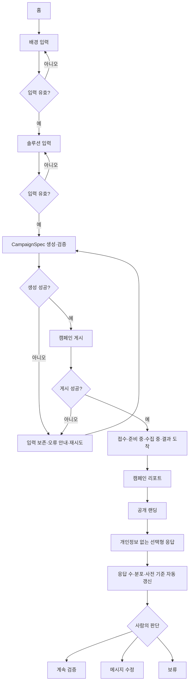

# 사용자 흐름과 화면 설계 경계

상태: Figma 기반 mock 기능 흐름 구현 완료
기준일: 2026-08-25

이 문서는 기능 흐름만 정의한다. 배치, 색상, 타이포그래피와 컴포넌트 외형은 전달된 Figma 프레임을 기준으로 한다. 별도 GitHub 랜딩페이지 저장소에서는 시각 요소만 참고하며 구조와 기능은 가져오지 않는다.

## Before와 After

현재 흐름:

```text
아이디어 정리
 → 고객·문제·솔루션 재작성
 → 랜딩 문구 작성
 → 웹 빌더 조립·공개
 → 카드뉴스 흐름 작성
 → 장별 조판·파일 정리
 → 게시 문구·CTA·링크 재입력
 → 반응을 별도 문서에 취합
 → 다음 판단
```

목표 흐름:

```text
배경·솔루션 입력
 → 캠페인 자동 구성·게시
 → 공개 랜딩·캐러셀·게시 준비 파일
 → 선택형 응답 자동 집계
 → 사람이 다음 판단
```

정확한 제거 단계 수는 같은 입력과 발표자 기준으로 실제 조작을 세어 기록한다.

## 기능 상태 전이



## 화면별 기능 요구

### 홈 `/`

- 제품이 없애는 기존 작업의 Before/After 설명
- `새 캠페인`으로 2단계 입력 시작
- 발표 fixture 결과로 바로 이동하는 경로

### 아이디어 입력 `/new`

- 1단계 제품 배경, 2단계 솔루션 설명
- 각 단계 20자 이상 검증, 생성 중 중복 제출 차단과 입력 보존
- 준비된 예시 입력
- 별도의 가설 승인 화면 없이 2단계 제출 뒤 생성·게시

### 생성 진행 `/campaigns/[id]/progress`

- `접수 → 준비 중 → 수집 중 → 결과 도착` 상태 표시
- 게시된 campaign id를 유지해 해당 리포트로 이동

### 캠페인 결과 `/campaigns/[id]`

- 게시된 slug의 공개 URL, PNG ZIP, 게시 문구와 `Meta 게시 준비` 파일
- 서버 응답 수와 사전 기준을 보여주되 시장성을 자동 판정하지 않음
- `계속 검증`, `메시지 수정`, `보류` 중 사람의 선택 저장
- 다른 탭의 응답을 focus·가시성 변경과 짧은 polling으로 갱신
- 조회·저장·초기화 실패를 성공으로 표시하지 않음

### 공개 랜딩 `/p/[slug]`

- 게시된 `CampaignSpec`으로 렌더링되는 모바일 우선 페이지
- 개인정보가 없는 세 가지 선택형 관심 응답
- 성공, 서버 중복 응답과 재시도 가능한 실패 상태
- P0에서는 예약 폼과 연락처 입력 제외

## 반영한 디자인 기준

2026-08-24 전달된 Figma에서 홈, 2단계 온보딩, 4단계 진행 상태와 리포트 흐름을 반영했다. Figma에 없는 별도 가설 승인 화면은 제거했다. 예약·이메일 수집 표현은 개인정보 없는 선택형 응답이라는 제품 계약과 충돌해 사용하지 않았다. 공개 캠페인은 같은 `CampaignSpec`의 결정적 렌더러로 구성한다.
