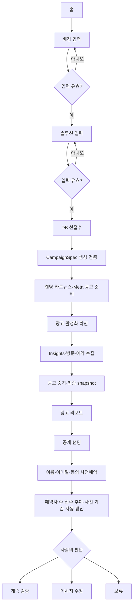

# 사용자 흐름과 화면 설계 경계

상태: Figma 기반 운영 lifecycle 기능 흐름 구현 완료
기준일: 2026-08-26

이 문서는 기능 흐름만 정의한다. 배치, 색상, 타이포그래피와 컴포넌트 외형은 전달된 Figma 프레임을 기준으로 한다. `proo-landing.vercel.app`과 별도 GitHub 랜딩페이지 저장소는 생성되는 공개 랜딩 `/p/[slug]`의 산출물 레퍼런스일 뿐이며, 제품 인터페이스 `/`, `/new`, 진행 화면과 리포트의 구조·기능·라우팅에는 적용하지 않는다.

## Before와 After

현재 흐름:

```text
아이디어 정리
 → 고객·문제·솔루션 재작성
 → 랜딩 문구 작성
 → 웹 빌더 조립·공개
 → 카드뉴스 흐름 작성
 → 장별 조판·파일 정리
 → 게시 문구·CTA·링크 재입력
 → 반응을 별도 문서에 취합
 → 다음 판단
```

목표 흐름:

```text
배경·솔루션 입력
 → 접수 저장
 → 랜딩·캐러셀·Meta 광고 자동 구성·활성화
 → 실제 Insights·방문·예약 자동 집계
 → 종료·최종 리포트
 → 사람이 다음 판단
```

정확한 제거 단계 수는 같은 입력과 발표자 기준으로 실제 조작을 세어 기록한다.

## 기능 상태 전이



## 화면별 기능 요구

### 홈 `/`

- 제품이 없애는 기존 작업의 Before/After 설명
- `새 광고`로 2단계 입력 시작
- 로그인 계정의 실제 진행 중·완료 광고만 표시

### 아이디어 입력 `/new`

- 1단계 제품 배경, 2단계 솔루션 설명
- 2단계에 제품·서비스 이름과 핵심 특징을 함께 적으면 생성기가 이를 상품명·특징 슬롯에 보존
- 각 단계 20자 이상 검증, 생성 중 중복 제출 차단과 입력 보존
- 예시 자동 입력과 기본 seed 없음
- 별도의 가설 승인 화면 없이 2단계 제출 즉시 진행 화면으로 전환

### 진행 `/campaigns/[id]/progress`

- 접수 성공 직후 이동하고 DB lifecycle의 `접수·준비 중·수집 중·결과 도착`을 표시
- 15초 polling, focus와 visibility 복귀 시 최신 상태 갱신
- 브라우저 종료·다음 날 재로그인 뒤에도 같은 계정의 현재 단계 복원
- 일시 오류는 입력과 원래 단계를 보존한 `RETRY_WAIT`, 영구 오류는 `FAILED`로 표시
- 완료 전 리포트 직접 접근은 진행 화면으로 되돌림

### 광고 결과 `/campaigns/[id]`

- 게시된 slug의 공개 URL, 실제 광고와 같은 서버 PNG 5장과 ZIP
- Meta Insights, 고유 방문, 예약자 수·접수 추이와 사전 기준을 보여주되 시장성을 자동 판정하지 않음
- `계속 검증`, `메시지 수정`, `보류` 중 사람의 선택 저장
- 다른 탭의 예약을 focus·가시성 변경과 짧은 polling으로 갱신
- 조회·저장·초기화 실패를 성공으로 표시하지 않음

### 공개 랜딩 `/p/[slug]`

- 게시된 `CampaignSpec`으로 렌더링되는 모바일 우선 페이지
- 필수 이름·이메일·개인정보 수집 동의가 있는 사전예약 폼
- 성공, 같은 캠페인·이메일 중복과 재시도 가능한 실패 상태
- 공개 응답에는 예약자 수·목록을 포함하지 않고 소유자 목록의 이메일도 마스킹

## 반영한 디자인 기준

2026-08-24 전달된 Figma 파일에서 다음 항목을 확인해 제품 화면에 반영했다.

1. 메인 웹사이트의 홈·2단계 입력·진행·광고 결과 desktop·375px 프레임
2. 색상, 타이포그래피, 간격, radius와 아이콘 기준
3. 생성 중, 빈 상태, 오류, 중복 응답과 사실 확인 경고
4. 실제 한국어 문구 길이와 캐러셀 1080×1350 표지 `31`, `32`, `34`
5. 랜딩페이지 도입부 고정 템플릿 `1`부터 `7`의 문제·상품명·한 줄 특징·특징 키워드 슬롯

Figma에 없는 별도 가설 승인 화면은 제거했다. ADR-0013에 따라 예약·이메일 수집 방향을 채택하되 필수 동의, 중복 방지, 마스킹과 소유자 경계를 제품 계약으로 고정했다. 화면 상태, 색상, 타이포그래피와 진행·리포트 구조를 따르고, 표지와 랜딩 도입부 템플릿 선택을 같은 `CampaignSpec`에 고정했다.
