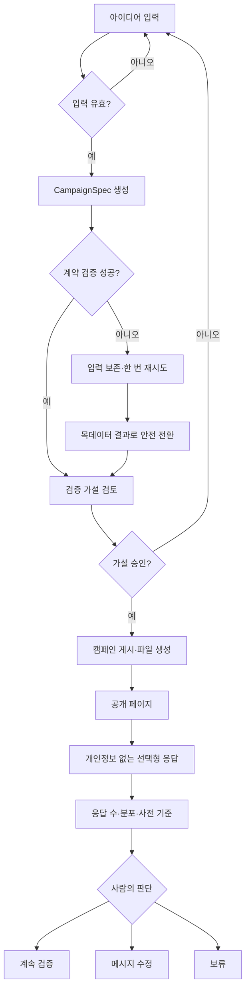

# 사용자 흐름과 화면 설계 경계

상태: 기능 흐름 확정, 시각 설계 대기
기준일: 2026-08-24

이 문서는 기능 흐름만 정의한다. 와이어프레임, 배치, 색상, 타이포그래피와 컴포넌트 외형은 확정하지 않는다. 별도 GitHub 랜딩페이지 저장소의 시각 요소와 디자인 담당자의 메인 웹사이트 최종 프레임이 시각 구현의 기준이며, 랜딩 저장소의 구조와 기능은 가져오지 않는다.

## Before와 After

현재 흐름:

```text
아이디어 정리
 → 고객·문제·솔루션 재작성
 → 랜딩 문구 작성
 → 웹 빌더 조립·공개
 → 카드뉴스 흐름 작성
 → 장별 조판·파일 정리
 → 게시 문구·CTA·링크 재입력
 → 반응을 별도 문서에 취합
 → 다음 판단
```

목표 흐름:

```text
아이디어 입력
 → 검증 가설·반증 조건 승인
 → 랜딩 공개·캐러셀·게시 준비 파일 생성
 → 선택형 응답 연결
 → 사람이 다음 판단
```

정확한 제거 단계 수는 구현 후 같은 입력과 발표자 기준으로 조작을 세어 기록한다.

## 기능 상태 전이



## 화면별 기능 요구

### 아이디어 입력

- 필수 아이디어와 선택형 고객·신호·톤 입력
- 빈 입력 오류, 생성 중 중복 제출 차단, 입력 보존
- 준비된 예시 입력
- 제품이 없애는 기존 작업의 Before/After 설명

### 가설 승인

- 고객, 문제, 해결, 기대 신호, 반증 조건과 사실 확인 경고
- 사전 판단 기준 승인 또는 입력 단계로 돌아가기
- 승인 처리 중 중복 실행 차단과 단계별 실패 상태
- 랜딩·캐러셀·Meta용 화면 결과는 표시하지 않음

### 캠페인 결과

- 실제 공개 URL, PNG·ZIP, 게시 문구와 `Meta 게시 준비` 파일
- 응답 수와 사전 기준을 보여주되 시장성을 자동 판정하지 않는 사람의 선택

### 공개 랜딩

- 같은 `CampaignSpec`으로 렌더링되는 모바일 우선 페이지
- 개인정보가 없는 세 가지 선택형 관심 응답
- 성공, 중복 응답과 실패 상태
- P0에서는 예약 폼과 연락처 입력 제외

### 판단

- 공개 URL, 실제 응답 수·분포, 사전 기준과 표본 부족 상태
- `계속 검증`, `메시지 수정`, `보류` 중 사람의 다음 행동
- seed 응답과 fixture를 실제 사용자 조사로 오인하지 않도록 `데모 데이터` 표시

## 디자인 인계 조건

구현 전에 다음 항목을 디자인 담당자와 확인한다.

1. 메인 웹사이트의 입력·가설 승인·캠페인 결과 desktop·375px 프레임
2. 색상, 타이포그래피, 간격, radius와 아이콘 기준
3. 생성 중, 빈 상태, 오류, 중복 응답과 사실 확인 경고
4. 실제 한국어 문구 길이와 캐러셀 1080×1350 프레임
5. 별도 랜딩 저장소에서 참고할 시각 요소와 새 제품에 적용할 토큰

이 조건이 갖춰지기 전에는 임시 UI를 구현하거나 이전 mock 화면을 참고하지 않는다.
